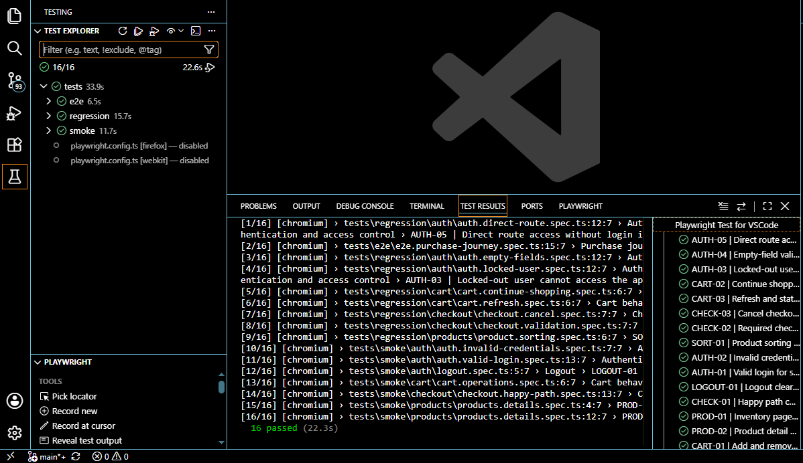
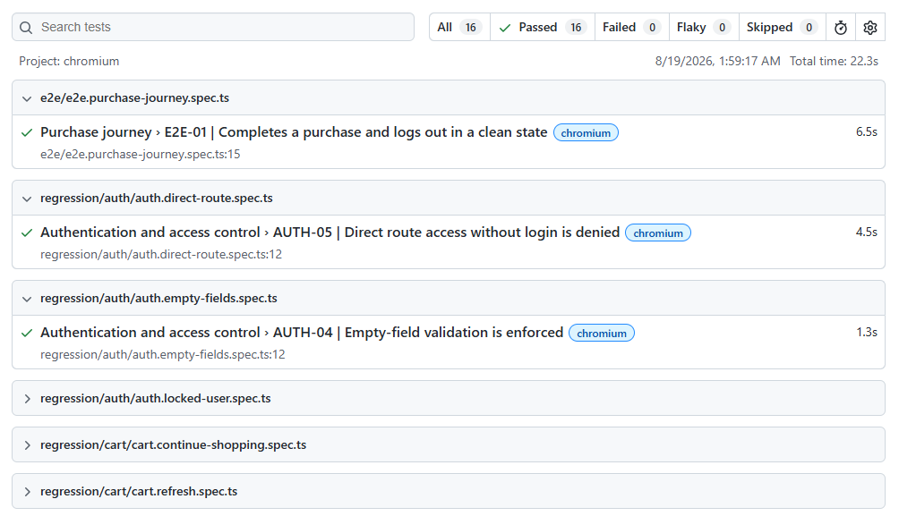
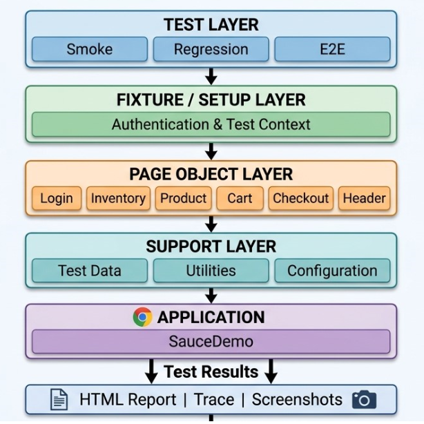

# SauceDemo Playwright QA Automation

> Portfolio-grade end-to-end test automation framework built with Playwright and TypeScript, demonstrating practical QA engineering practices, maintainable automation architecture, cross-browser testing, reporting, and AI-assisted test development.

---

## 🎯 Project Overview

This project is a portfolio-focused QA automation framework for [SauceDemo](https://www.saucedemo.com/), a demo e-commerce web application.

The objective was not only to automate functional scenarios, but to design a maintainable Playwright framework that demonstrates how I approach software quality and test automation as a QA Engineer.

The framework focuses on:

- Risk-based test coverage
- Page Object Model
- Reusable Playwright fixtures
- Centralized test data
- Stable locator strategy
- Web-first assertions
- Test isolation
- Smoke, regression, and E2E coverage
- Cross-browser testing
- Failure diagnostics and reporting
- AI-assisted application exploration and test development

---

## 🧪 QA Capabilities Demonstrated

| Area | Implementation |
|---|---|
| Test Design | Risk-based functional test scenarios |
| UI Automation | Playwright + TypeScript |
| Framework Design | Page Object Model |
| Test Organization | Smoke, Regression, and E2E |
| Test Data | Centralized test data |
| Fixtures | Reusable authenticated test context |
| Locators | Stable `data-test` and semantic locators |
| Assertions | Playwright web-first assertions |
| Browser Coverage | Chromium, Firefox, and WebKit |
| Reporting | Playwright HTML Report |
| Diagnostics | screenshots, and test artifacts |
| Version Control | Git + GitHub |
| AI-Assisted Testing | Playwright MCP and Playwright Agents |

---

## 🔍 Test Coverage

### 1. Authentication & Access Control

- Valid user login
- Invalid credentials
- Locked-out user
- Empty credential validation
- Protected-route access
- Logout

### 2. Inventory, Product Details & Sorting

- Inventory page rendering
- Product information validation
- Product detail navigation
- Product detail information validation
- Sort products by name ascending
- Sort products by name descending
- Sort products by price ascending
- Sort products by price descending

### 3. Cart Behavior & Persistence

- Add products to cart
- Remove products from cart
- Cart badge/count validation
- Continue shopping
- Cart persistence
- Cart state validation

### 4. Checkout

- Checkout navigation
- Required field validation
- Checkout information validation
- Checkout overview
- Successful checkout
- Checkout cancellation

### 5. End-to-End Purchase Journey

The framework also covers the complete critical user journey:

Login
  ↓
Browse Products
  ↓
Select Product
  ↓
Add to Cart
  ↓
Review Cart
  ↓
Checkout
  ↓
Order Confirmation
  ↓
Logout

## 📊 Test Evidence & Validation

> **Designed → Implemented → Executed → Validated**

This project includes supporting evidence that demonstrates the automation
framework was not only designed and implemented, but also executed and
validated through Playwright test runs and reporting.

### 🧪 Test Execution

The automated test suites were executed to validate the implemented
functional coverage and confirm the behavior of the test framework.

**Evidence demonstrates:**

- Automated test execution
- Test suite results
- Successful scenario validation

---

### 📈 Playwright HTML Report

Playwright's HTML report provides a detailed view of the test execution,
including individual test results and execution status.

The report provides a clear and structured way to review automation
results and investigate failed scenarios.

---

## 📋 Test Planning & Documentation

Automation was approached as a **QA engineering process**, rather than
simply writing test scripts.

Before implementation, the application was analyzed and the test
coverage and automation approach were documented.

### 📚 Planning Documents

text
docs/
└── ai-generated/
    ├── initial-test-plan.md
    └── automation-strategy.md

## 🤖 AI-Assisted QA Engineering

AI was incorporated into the development workflow as a **productivity,
exploration, and engineering assistance layer** — not as a replacement
for QA expertise or decision-making.

### 🔎 Playwright MCP

[Playwright MCP](https://github.com/microsoft/playwright-mcp) was used to
support application exploration and browser-based investigation during
the automation development process.

It helped with:

- Application exploration
- UI inspection
- Locator discovery
- Understanding application behavior
- Validating UI interactions before automation

### 🧠 Playwright Agents

Playwright Agents were used to accelerate selected automation activities,
including:

- Test planning
- Test scenario development
- Test script generation
- Self healing

AI-generated output was reviewed and refined before being incorporated
into the framework.

### 👤 Human QA Ownership

AI assistance did not replace QA engineering judgment.

The following decisions remained under human QA review and ownership:

- **Test scope**
- **Risk assessment**
- **Expected behavior**
- **Test scenarios**
- **Assertions**
- **Locator strategy**
- **Framework architecture**
- **Maintainability decisions**
- **Final validation**

> **AI accelerated the process; QA engineering owned the quality.**

---

## 🏗️ Automation Architecture

The framework follows a maintainable Playwright architecture that
separates test scenarios, reusable fixtures, Page Objects, test data,
utilities, and application interaction.

The architecture was designed with the following principles:

- **Readable tests** focused on business scenarios
- **Page Object Model** for reusable UI interactions
- **Fixtures** for controlled and reusable test setup
- **Centralized test data** separated from test logic
- **Stable locators** to improve test reliability
- **Reusable utilities** to reduce duplication
- **Smoke, regression, and E2E layers** for different testing objectives

This architecture allows the framework to remain **readable,
maintainable, scalable, and easier to debug** as test coverage grows.

## 🤝 Connect With Me

### 👨‍💻 Suren Jayathunga

**Software QA Engineer | Test Automation | Playwright | TypeScript**

 

